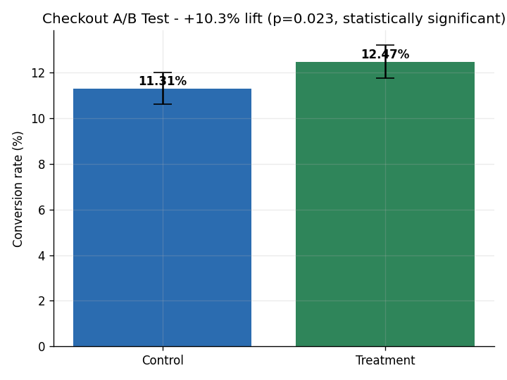
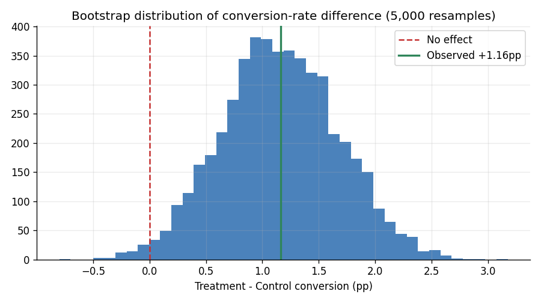

# A/B Test Analysis, Checkout Redesign

I ran the full analysis on a two arm conversion experiment with 16,000 users testing a new
checkout flow, from significance testing all the way to a ship or no ship call.

Stack: Python, pandas, SciPy, Matplotlib

## The question
Does the redesigned checkout actually lift conversion, is the lift real or just noise, and
should we ship it?

## The data
`data/experiment.csv` has 8,000 users per arm, control and treatment, each with a conversion
flag and revenue. I generated it with a known true effect (`ab_test.py`, fixed seed) so I
could check the statistical workflow against ground truth. Synthetic and reproducible.

## Run it
```bash
pip install -r requirements.txt
python ab_test.py
```
Charts and a findings summary land in `charts/`.

## How I analyzed it
I used a two proportion z test on conversion with a 95% confidence interval on the
difference, a Welch t test on revenue per user, a bootstrap with 5,000 resamples to show the
sampling distribution of the effect, and a power and minimum detectable effect check to
confirm the test was powered well enough to trust.

## What I found
Conversion went from 11.31% in control to 12.47% in treatment, a +1.16pp absolute lift and
a +10.3% relative lift.

The result is statistically significant, with z = 2.27 and p = 0.023. The 95% confidence
interval on the difference is +0.16pp to +2.17pp, which does not include zero.

Revenue per user went from $6.32 to $7.38 with a Welch p of 0.001, so the lift is real
revenue and not just more small orders.

The test was powered well. The minimum detectable effect at 80% power was 1.41pp, and the
observed effect cleared the bar.

My call is to ship it. The redesign delivers a real, revenue positive gain.

## Charts
| Conversion with 95% CI | Bootstrap distribution of the effect |
|---|---|
|  |  |

## What this cannot tell you

The data is synthetic and generated with a known true effect (+1.5pp) and a fixed seed.
That makes it useful for one thing: checking that the statistical workflow recovers an
effect it is supposed to find. It says nothing about checkout design, and the lift here
is not evidence about any real redesign.

Three things a real experiment would have to deal with that this one does not. Users are
assumed independent and assigned once, so there is no repeat exposure and no interference
between arms. The experiment is read once at the end, so there is no peeking and no
sequential testing correction. And the whole thing assumes the randomiser and the logging
both worked, which is what the SRM check at the top is for and the only reason it is there.

Conversion is the primary metric and the ship decision rests on it alone. Revenue per user
is reported as a guardrail, to catch the case where conversion rises because people buy
cheaper things, not as a second result to celebrate.
